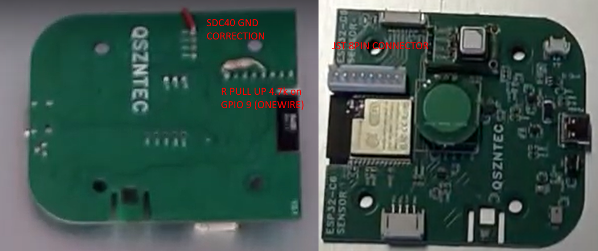
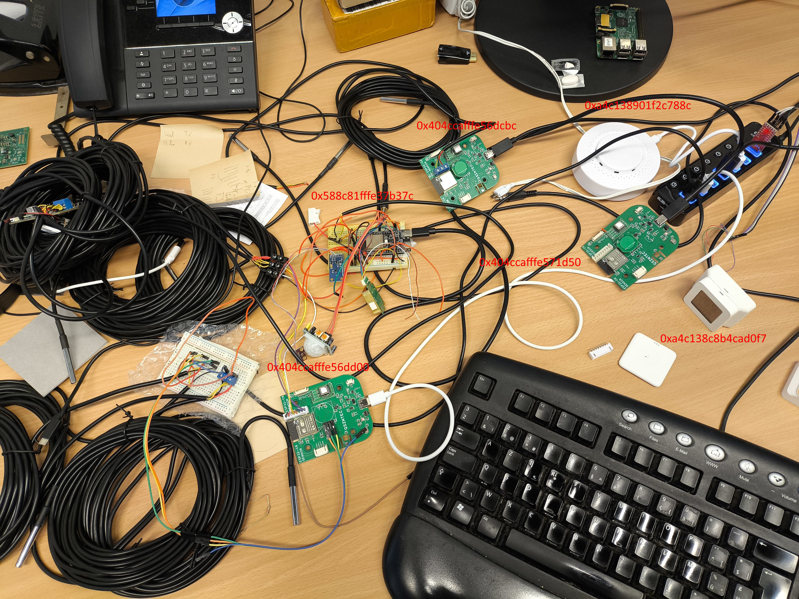
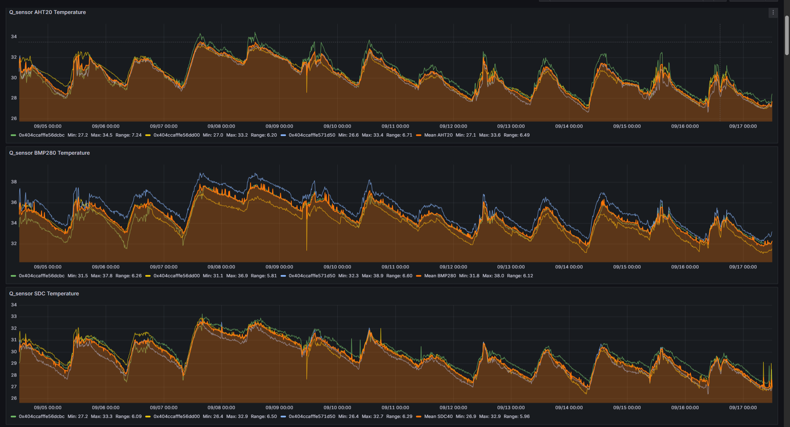
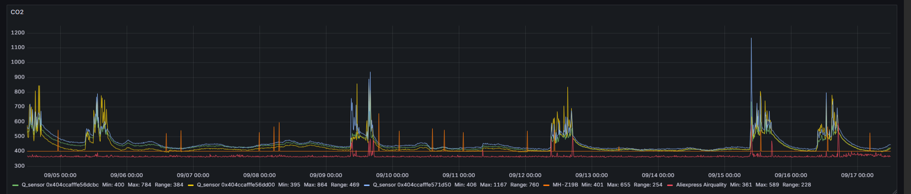
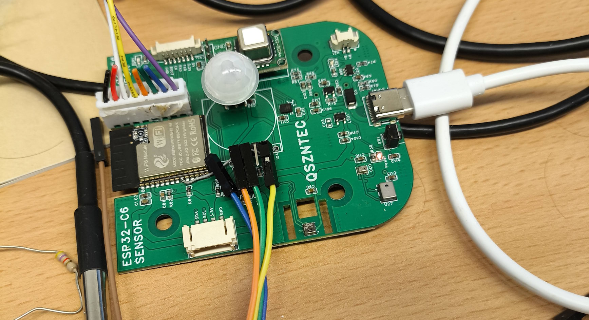

# Q_sensor Review

## Introduction

This readme presents a review on the accuracy of the following [ESP32-C6 multi sensor (alias Q_sensor)](https://www.tindie.com/products/adz1122/esp32-c6-multi-sensor-co2-voc-imu/) measurements:
- Temperatures given by the AHT20, BMP280 and SDC40 sensors
- Humidities given by the AHT20 and SDC40 sensors
- CO2 given by the SDC40 sensor

It enlights some problems with the SDC40 and other sensors of the Q_sensor and also focused on adding several DS18B20 temperature probes to the Q_sensor. The firmware used in these devices was directly based on [xyzroe's Zigbee code](https://github.com/xyzroe/Q_sensor).

[[_TOC_]]

## Material and methodology

### ESP32-C6 multi sensors

5 Q_sensors were ordered:
- 2 Q_sensors v2.1 on [Tindie](https://www.tindie.com/products/adz1122/esp32-c6-multi-sensor-co2-voc-imu/) with a SDC40 or SDC41 module (**no laser marking on the sensor!**, see [datasheet](https://sensirion.com/media/documents/48C4B7FB/64C134E7/Sensirion_SCD4x_Datasheet.pdf) page 24) directly soldered on the Q_sensor PCB
- 3 Q_sensors v2.2 on [Aliexpress](https://fr.aliexpress.com/item/1005007922381128.html), each, with a laser marked SDC40 module.

**Please note that both Q_sensors v2.1 had some ground connections issues with the PCB that were corrected and one Q_sensor v2.2 had power supply issue on the PCB (brownout detector triggered) and was unusable!**

All Q_sensors wered modified to add a Onewire bus on GPIO 9 (BOOT) (see image below) with a  4.7kΩ pull-up resistor under the PCB. This allows up to 5 DS18B20 temperature sensors to be connected, typically with a 5m cable length (max 4x5m & 1x1m were supported), via an 8-pin JST connector on the H6 Header. A second Onewire was added on GPIO 1 of one of the Q_sensor v2.2 in order to increase the number of DS18B20s to a maximum of 8 DS18B20s (typically 5-6) with a 5m cable, as reading errors were too numerous with a single bus connecting 5 DS18B20 probes. 

Please note that the Q_sensor also contains a light sensor (BH1750 lux measurement), a presence detection radar (BS5820), a VOC sensor (AGS10) and an IMU (QMI8658C) that were not thoughtfully analyzed in this review.

### Other devices

In order to compare the measurements given by the Q_sensors, 3 other devices were used:
1. A [Xiaomi LYWSD03MMC with a custom zigbee firmware](https://www.zigbee2mqtt.io/devices/LYWSD03MMC-z.html#xiaomi-lywsd03mmc-z) measuring room temperature and humidity (a [SHTC3 sensor](https://sensirion.com/media/documents/643F9C8E/63A5A436/Datasheet_SHTC3.pdf) is used for Humidity & Temperature measurement). 
2. A [TS0601 air quality sensor](https://www.zigbee2mqtt.io/devices/TS0601_air_quality_sensor.html#tuya-ts0601_air_quality_sensor) measuring room temperature, humidity and CO2. This sensor alos gives VOC and Formaldehyd measurements which were not used.
3. A _DIY_ (Do-It-Yourself) ESP32-C6, called *R_sensor*, with a [BME280](https://www.bosch-sensortec.com/media/boschsensortec/downloads/datasheets/bst-bme280-ds002.pdf) module for room temperature and humidity and a MH-Z19B for CO2. A HC-SR501 PIR detector (for presence detection) and a BH1750 light sensor were also connected to this device but were not used in this review. 

### Experimental measurement campaign

In total, 6 Zigbee devices were used in a 14-day measurement campaign, including 3 Q_sensors without their box and the 3 other devices described in the previous section. The devices with their name/Zigbee address are given below:
1. `0x404ccafffe571d50`: Q_sensor v2.1 without DS18B20 probe
2. `0x404ccafffe56dcbc`: Q_sensor v2.2 with 1 DS18B20 probe
3. `0x404ccafffe56dd00`: Q_sensor v2.2 with 2 onewire buses each connecting 4 DS18B20 probes (total 8 probes)
4. `0xa4c138c8b4cad0f7`: Xiaomi LYWSD03MMC 
5. `0xa4c138901f2c788c`: TS0601 air quality sensor
6. `0x588c81fffe37b37c`: R_sensor 

As the following image shows, all devices were placed on a desk in an office room where a person might occasionally be present next to the devices.

All devices were connected to a USB Zigbee coordinator dongle in the same room using [Zigbee2MQTT](https://www.zigbee2mqtt.io/) with a reporting of maximum 10min for each Q_sensor and R_sensor measurement on a installed mqtt server [`mosquitto`](https://www.zigbee2mqtt.io/guide/usage/integrations/home_assistant.html), max 1h for the LYWSD03MMC device and unknown for the TS0601 air quality sensor (but probably a few seconds as specified in the `Notes` of this [link](https://www.zigbee2mqtt.io/devices/TS0601_air_quality_sensor.html#tuya-ts0601_air_quality_sensor)).

In order to easily record measurements sent by different devices in a time series [influx2 database](https://docs.influxdata.com/influxdb/v2/), [Home-Assistant](http://home-assistant.io/) was connected to the same mqtt server as Zigbee2MQTT and Zigbee2MQTT was also configured for [Home-Assistant](https://www.zigbee2mqtt.io/guide/usage/integrations/home_assistant.html). In parallel, Home-Assistant was linked to [an external influx2 database](https://www.home-assistant.io/integrations/influxdb/) to record all measurements.

Finaly, to easily analyze the precision of the measurements in the influx2 database, a [grafana](https://grafana.com) dashboard using the influx2 database as source was created. 

## Results and discussion

### Temperature

During the campaign, the temperature variation in the room for all sensors (i.e. max temp minus min temp) was 6°C (+/-1°C). As shown in the figures below, all sensors give the same evolution of the room temperature during the experiment. However, the temperature values ​​are completely different and this difference will be analyzed further. 

For the same temperature sensor, the range is around 1°C (75%) for the AHT20, the SDC40 and the DS18B20 and +/-1.75°C (75%) for the BMP280. Most temperature values ​​within the same sensor family are generally very close with the exception of the BMP280 as shown in the next figures. 

As shown in the next figure, the range of the 3 other temperature sensors is around 1.2°C (75%) which is in accordance with the accuracy of these devices. 

**Since the temperatures of other sensors are closed enough, the mean temperature of these sensors will be used as the real room temperature (ground truth).**

Additionally, in order to reduce the number of sensors to be analyzed, the average temperature of each sensor family will be used, even if, for the BMP280, it is less accurate. The following figures illustrate this analysis using average temperature values.

**An important bias is present for all temperature sensors of the Q_sensor, more precisily, when you compare to other sensors, the AHT20 has a bias (mean/median value) of ~4°C, the SDC40 of ~4°C and the BMP280 of 9°C!**. 

The source of this biased temperature measurement might be:
- Bad sensor batch/uncalibrated sensors
- Overheating of the sensor when directly soldered on the PCB

Since the evolution of the temperature seems correct, a constant temperature offset can be removed for each sensor family but a good sensor calibration would be better. 

### Humidity 

For the analysis of humidity measurements, the same approach as for temperatures is used. The following figure illustrates the humidity variation for the two Q_sensor humidity sensors (AHT20 and SDC40) and for the other humidity sensors. The humidity variation in the room for all sensors was approximately 17% +/- 2%. Note that this variation is relatively more important because the intrinsic precision of humidity sensors is generally of the order of 3-5%.

For the same humidity sensor, the range is around 3% (75%) for the AHT20 and the SDC40. Most humidities ​​within the same sensor family are generally close. 

As shown in the next figure, the range of the 3 other humidity sensors is around 4% (75%) which is in accordance with the accuracy of these devices.

**Since the humidities of other sensors are closed enough, the mean humidity of these sensors will be used as the real room humidity (ground truth).**

Additionally, in order to reduce the number of sensors to be analyzed, the average humidity of each sensor family will be used. The following figures illustrate this analysis using average humidity values.

**A bias of ~8% (mean/median values) of both humidity sensors in the Q_sensors compared to other sensors is present.**

**Since the relative humidity depends on the room temperature, this bias is probably linked to the temperature one which was, for these sensors (AHT20 & SDC40), nearly the same (+/- 4°C). The [following analysis](./src/analyze.ipynb) seems to prove this hypothesis by computing the absolute humidity ((k)g/m³) from the relative humidity (%) and temperature (K) (based on this [source](https://www.omnicalculator.com/physics/absolute-humidity)) where the mean absolute humidities of AHT20, SDC40 and other sensors are very close.**

### CO2

The CO2 sensor of the Q_sensor is a SDC40. The Air quality sensor bought on Aliexpress also has a CO2 sensor but it is probably a fake one or an eCO2 one (see also the first `Notes` of this [link](https://www.zigbee2mqtt.io/devices/TS0601_air_quality_sensor.html#tuya-ts0601_air_quality_sensor)). Regarding the MH-Z19B sensor on the DIY R_sensor, it didn't correctly measure the CO2. This issue might be linked to the library used, a sensor problem or the auto-calibration feature. All CO2 measurements are shown in the figure below.

Finaly, since a good evolution of the CO2 is only present on the SDC40 sensors, it is only possible to compare this evolution between them. The next figure shows that the range between sensor is around 30ppm (75%) which is in accordance with its accuracy (50ppm in the [datasheet](https://sensirion.com/media/documents/48C4B7FB/64C134E7/Sensirion_SCD4x_Datasheet.pdf) page 3)

The previous figure also clearly shows the presence of a person in the room. In this case, the evolution of the CO2 values ​​of the sensors differs more. This is easily explained by the fact that the person is very close to the sensors, which causes the CO2 to spread differently around them, with chaotic peaks. The CO2 concentration is not yet uniform in the room. Once the person leaves the room, the CO2 decreases more uniformly.

### Other Q_sensor measurements

#### Presence Detection (Radar BS5820)

The Q_sensor radar continue to trigger even if no one is in the room. Since this radar doesn't work at all, it can be removed or replaced by a PIR sensor, e.g. the [AM312/HC-SR321](https://nl.aliexpress.com/item/1005008762602103.html) as shown in the picture below.  

This sensor seems to perform better than the radar. However, the PIR was triggered very often at first, even when there was no one in the room, but this behavior has disappeared. Since this type of sensor is very sensitive to power quality, these false triggers could be related to noise on the power line (3.3 V). Further investigation should be done. Another solution would be to use an HC-SR501 PIR sensor which integrates a power drop out from 5V to 3.3V but the 5V line from the USB is not available on a header of the PCB to test this solution. 

#### VOC Sensor (AGS10)

Unfortunately, these measurements were not recorded in the influx2 database during the experimental campaign because this value was not automatically recognized by Home-Assistant. Nevertheless, by having a look to the VOC values obtained by the 3 Q_sensors, all values were very different e.g. 2 vs 78 vs 118 points! **This sensor appears to be unreliable,** although further analysis should be carried out to confirm this.

## Conlusion

**The Q_sensor is, in theory, an excellent air quality device but it is unfortunate that the built-in temperature and humidity sensors are not calibrated/decalibrated**. For the temperature measurement, an offset could be applied in the software but it must be calibrated. The actual relative humidity could be obtained from the absolute humidity calculated from the measured temperature and humidiy. But, if these temperature offsets are linked to the soldering temperature, it could be easy to avoid this issue, by adpating the temperature or by using a module instead of components on the PCB e.g. this [module](https://nl.aliexpress.com/item/1005006825767164.htm) or a [BME280 module](https://nl.aliexpress.com/item/1005009214592901.html) replacing both AHT20 & BMP280 sensors.

T**he SDC40 modules seems to give correct CO2 measurements** but it would be better to be sure that the components are original since no laser marking are present on the Q_sensor PCB v2.1 and the laser marking on other SDC40 was not checked to verify it was an original one.

